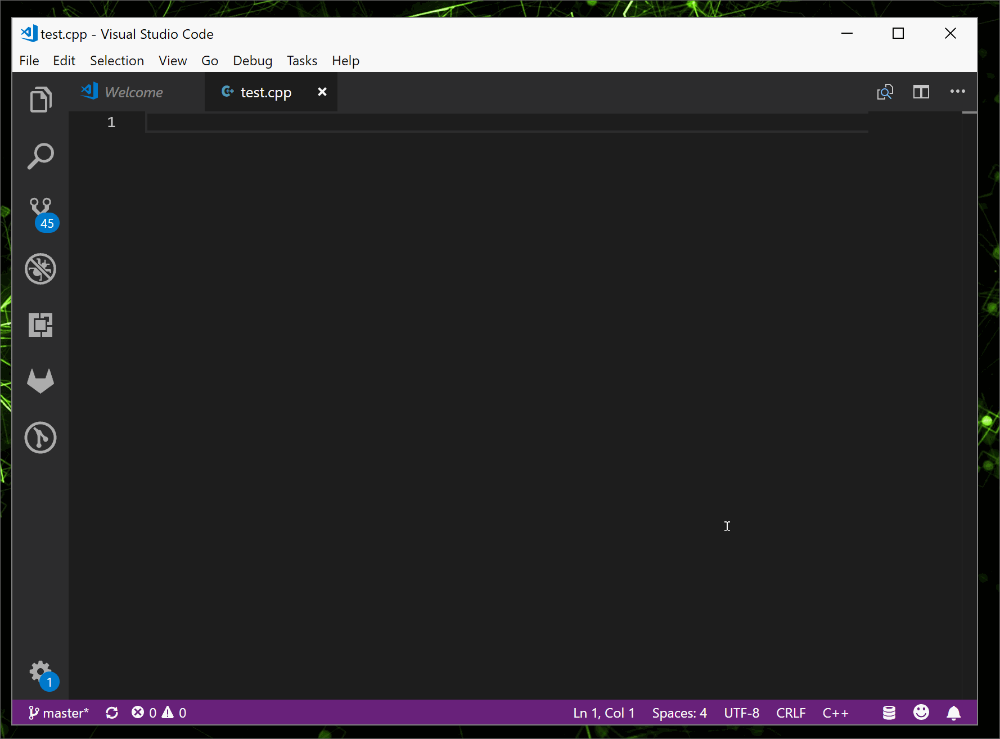

# vscode-Awesome CPP Snippets
The most complete C/C++ snippets for VS Code.

### Getting Started
#### Prerequisites
Visual Studio Code (version > 1.10.0)

#### Installing
* Step1: Install [Visual Studio Code](https://code.visualstudio.com/).
* Step2: Press Ctrl + Shift + X (windows), Choose the extension "Awesome CPP Snippets", Click the install button.
* Step3: Relaunch Visual Studio Code to make the extension work.

### Usage
*Options*

|prefix|discrition|
|:------:|:------:|
|info|file info|
|cpp|C++ quick start|
|cppcv|C++ quick start for OpenCV|
|more is comming||

*Demo*

### Contributing
Please read [CONTRIBUTING.md]() for details on our code of conduct, and the process for submitting pull requests to us.

### Versioning 
We use [SemVer](https://semver.org/) for versioning. For the versions available, see the [tags on this repository](https://github.com/xindzju/vscode-cppsnippets/tags).

### Authors
* Charles Deng  --Initial work-- [xindzju](https://github.com/xindzju)

See also the list of [contributors](https://github.com/xindzju/vscode-cppsnippets/graphs/contributors) who participated in this project.

### License
This project if licensed under the MIT License - see the [LICNESE](https://github.com/xindzju/vscode-cppsnippets/blob/master/LICENSE) file for details.

### Acknowledgements
* Hat tip to anyone whose code are used
* Inspiration
* etc